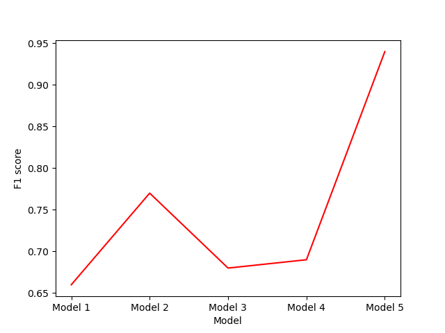

# Modeling
This directory contains notebooks and descriptions of all models developed.

As can be seen in the _EDA_ directory, there is both image data and associated metadata, patient ID, including general age, sex, and location of the image on the patient's body. 

## Data
### Metadata
Patient ID was excluded from the metadata model because that data is only valuable if future predictions will be based on those patients. For future patients, this data is confounding: It is at best irrelevant and at worst outright destructive.

_Age_ was kept in its raw state, while _Sex_ and _Location on Body_ were transformed to dummy variables.

For discussion of processing of metadata, see the _[Imputation analysis](https://github.com/HechtYehuda/Melanoma_model/blob/master/Preprocessing/Imputation%20analysis.ipynb)_ notebook. 

### Images
Owing to a combination of factors, such as memory constraints and lack of uniformity of image size, all images were resized to 80x120.

## Models
All models were built with Keras on top of TensorFlow 2.4. The models used are based on the [Functional API](https://keras.io/guides/functional_api/), which allowed for development of a mixed model: The metadata ran through one or two Dense layers (based on the model), and the image data ran through either a basic Convolutional layer, or through the Xception convolutional architecture, trained on the [ImageNet](https://image-net.org/) image database.

All layers included a ReLU (Rectified Linear Unit) activation function, except for the final layer, which classified based on the Sigmoid function. The loss function used is Binary Crossentropy, owing to the binary nature of the target. All models and training epochs were examined with the AUC metric. This metric was chosen because of the imbalanced nature of the data. Finally, the Precision, Recall, and F1 scores by class, as well as the weighted average of each.

In comparison of each model, I will discuss the weighted average F1 score. 

### Model 1: Raw Convolutional Model
Model 1 used a single four-unit Dense layer for the metadata, and a Padding layer, a single Convolutional layer, a Global Average Pooling layer, and another Dense layer for the image data. The intention of this model was to provide a benchmark for future transfer learning models. The weighted average F1 score of Model 1 was 0.66.

### Model 2: Transfer Learning Model
Model 2 began the transition into transfer learning. The model implemented the Xception covolutional architecture. The weighted average F1 score of Model 2 was 0.77.

### Model 3: Transfer Learning Model with denoised images
Model 3 involved preprocessing all images with denoising. Denoising saw damage to the weighted F1 score, but saw improvement to the minority class recall score (0.66 over 0.59 from Model 2). Because of the need to err on the side of caution and _over_-diagnose when it comes to melanoma, I decided to keep using denoised images for future models. The weighted average F1 score of Model 3 was 0.68.

### Model 4: Transfer Learning Model  with denoising and image rotation
Model 4 implemented minor image augmentation. Because there were 23,830 images with no melanoma and only 584 images with melanoma, I augmented each melanoma with rotation three times--at 90, 180, and 270 degrees. This augmentation saw only minor improvement to the weighted average F1 score. The weighted average F1 score of Model 4 was 0.69.

### Model 5: Transfer Learning Model with denoising and image augmentation
Model 5 implemented full-scale augmentation. Using the [Keras ImageDataGenerator](https://www.tensorflow.org/api_docs/python/tf/keras/preprocessing/image/ImageDataGenerator), Model 5 replicated the melanoma images 39 times with various augmentation techniques, including rotation, height and width shifting, brightness change, channel shifting, vertical and horizontal flipping, and shearing. The augmentation was seeded to ensure replicability. This model saw drastic improvement in the F1 score. The weighted average F1 score of Model 5 was 0.94.

### Summary
The following table provides a graphical representation of the F1 scores of the models:

## Conclusion
While the general trend has been toward improvement in overall weighted F1 scores, a more important metric for business solutions is the minority class F1 score (the 1-class F1 score). Since the models are scoring poorly on those metrics, there is still much work to do.